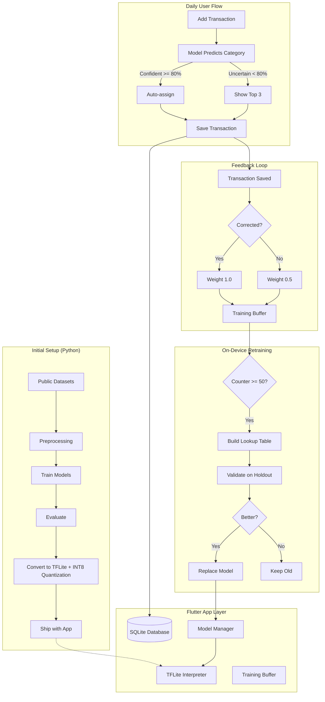

# Architecture

## Overview

Finance Tracker is a Flutter mobile app built with clean architecture principles, featuring four on-device TensorFlow Lite models for intelligent financial insights.

## System Flowchart



## App Architecture

### Layer Structure

```
lib/
├── core/           # Cross-cutting concerns
│   ├── constants/  # App-wide constants, category icons/colors
│   ├── router/     # GoRouter configuration with bottom navigation
│   ├── theme/      # Material 3 theme (indigo seed color)
│   └── utils/      # Currency formatting, helpers
├── features/       # Feature modules (vertical slices)
│   ├── transactions/
│   │   ├── data/           # SQLite datasource, repository implementation
│   │   ├── domain/         # Transaction entity, repository interface
│   │   └── presentation/   # Pages, widgets, Riverpod providers
│   ├── dashboard/
│   │   └── presentation/   # Summary cards, charts, forecast strip
│   ├── analytics/
│   │   └── presentation/   # Anomaly, forecast, savings tabs
│   └── settings/
│       └── presentation/   # Theme toggle, CSV export, ML status
└── shared/
    ├── database/   # SQLite schema and initialization
    ├── ml/         # All ML integration (see below)
    └── widgets/    # Bottom navigation, shared components
```

### State Management

**Riverpod** providers are used throughout:

| Provider | Type | Purpose |
|----------|------|---------|
| `transactionsProvider` | AsyncNotifier | CRUD operations with cache invalidation |
| `dashboardProvider` | FutureProvider | Aggregated dashboard metrics |
| `categorizerProvider` | FutureProvider | Lazy-loaded TFLite categorizer |
| `anomalyDetectorProvider` | FutureProvider | Lazy-loaded anomaly detector |
| `forecasterProvider` | FutureProvider | Lazy-loaded LSTM forecaster |
| `savingsAdvisorProvider` | FutureProvider | Lazy-loaded savings advisor |
| `trainingBufferProvider` | Provider | Feedback collection service |
| `modelManagerProvider` | Provider | Model versioning service |
| `retrainerProvider` | Provider | Retraining orchestrator |
| `themeModeProvider` | StateProvider | Light/dark/system theme |

### Database Schema

Three SQLite tables managed by `AppDatabase`:

```sql
-- Core financial data with ML metadata
CREATE TABLE transactions (
    id TEXT PRIMARY KEY,
    amount REAL NOT NULL,
    merchant TEXT NOT NULL,
    description TEXT,
    category TEXT NOT NULL,
    date TEXT NOT NULL,
    type TEXT NOT NULL,           -- income | expense
    is_anomaly INTEGER DEFAULT 0,
    predicted_category TEXT,
    confidence REAL,
    anomaly_score REAL,
    was_corrected INTEGER DEFAULT 0
);

-- Accumulated user feedback for retraining
CREATE TABLE training_buffer (
    id INTEGER PRIMARY KEY AUTOINCREMENT,
    merchant TEXT NOT NULL,
    correct_category TEXT NOT NULL,
    weight REAL NOT NULL,         -- 1.0=corrected, 0.5=accepted, 0.3=manual
    timestamp TEXT NOT NULL
);

-- Model versioning and activation tracking
CREATE TABLE model_metadata (
    id TEXT PRIMARY KEY,
    model_type TEXT NOT NULL,
    version INTEGER NOT NULL,
    accuracy REAL,
    created_at TEXT NOT NULL,
    is_active INTEGER DEFAULT 0
);
```

### Navigation

GoRouter with a `ShellRoute` for bottom navigation (4 tabs):
1. **Dashboard** — summary cards, spending chart, forecast strip, recent transactions
2. **Transactions** — full list with add/edit/delete
3. **Analytics** — tabbed view (Anomalies, Forecast, Savings)
4. **Settings** — theme, CSV export, ML model status

### ML Integration

All ML code lives in `shared/ml/` with clear responsibilities:

| File | Role |
|------|------|
| `categorizer.dart` | Tokenizes merchant names, runs LSTM, returns top-3 predictions |
| `anomaly_detector.dart` | Builds feature vector, runs autoencoder, computes MSE score |
| `forecaster.dart` | Aggregates daily expenses, runs LSTM, returns 7-day predictions |
| `savings_advisor.dart` | Computes spending ratios, classifies risk, generates recommendations |
| `training_buffer.dart` | SQLite-backed feedback queue with weighted samples |
| `model_manager.dart` | File-system model versioning with safe swap and rollback |
| `retrainer.dart` | Builds merchant→category lookup from feedback, validates, activates |
| `ml_providers.dart` | Riverpod providers for all ML services |

### Key Design Decisions

1. **TFLite is inference-only** — on-device retraining uses a merchant→category lookup table built from weighted feedback, not TFLite fine-tuning
2. **Models are optional** — the app works without `.tflite` files; ML features gracefully degrade (null checks throughout)
3. **Savings advisor has dual mode** — TFLite risk classifier when available, rule-based fallback always works
4. **Cold-start handling** — forecaster requires 30 days of history; UI shows progress indicator for new users
5. **Feature vector parity** — Dart inference code exactly replicates Python preprocessing (same tokenization, scaling, feature order)
